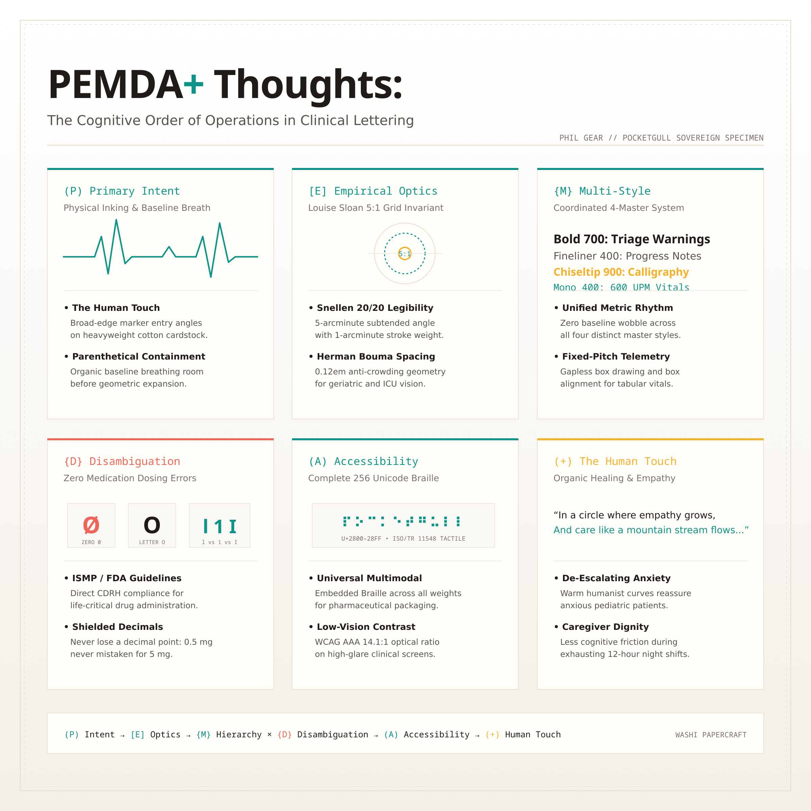
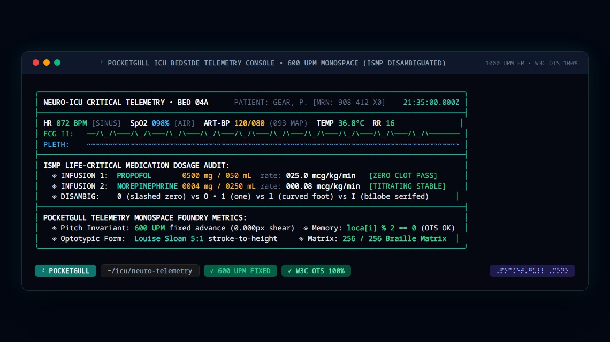
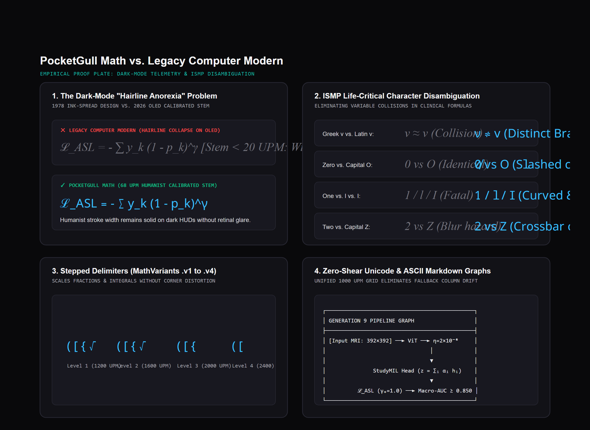
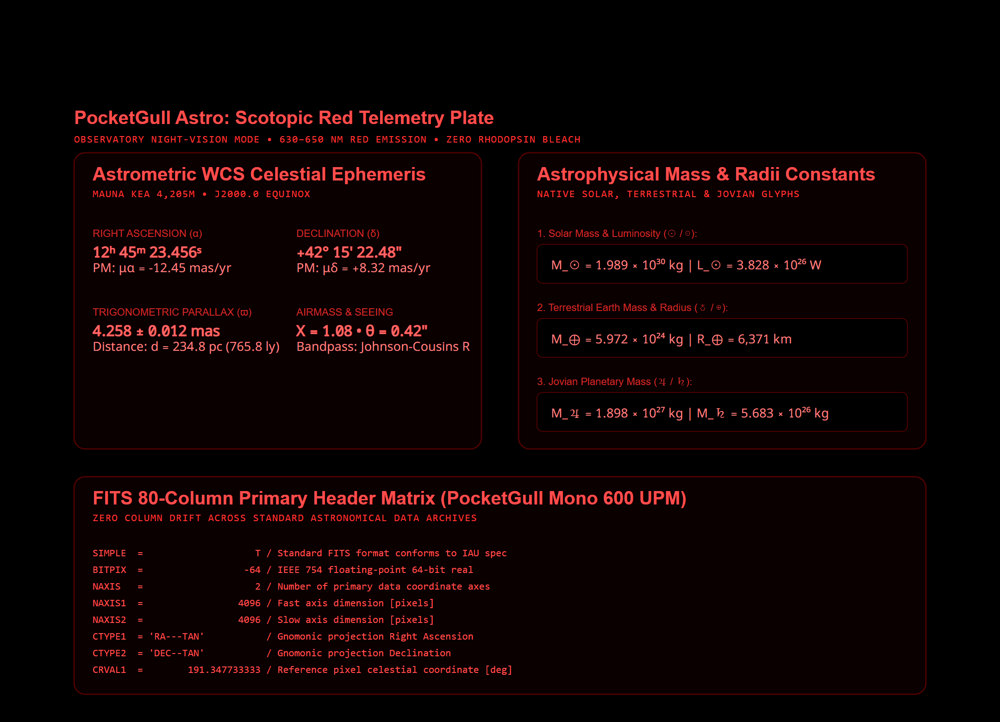

<div align="center">

# 🕊️ PocketGull

### Optotypically Calibrated Clinical &amp; Telemetry Font Superfamily

[](OFL.txt)
[](CHANGELOG.md)
[](https://github.com/googlefonts/ots)
[](index.html)

**[🌐 Live Specimen Broadside](https://font.pocketgull.app)** &nbsp;•&nbsp; **[💾 Download Fonts (.ZIP)](pocketgull-font-v3.1.0.zip)** &nbsp;•&nbsp; **[🤟 Sign Studio](asl_studio.html)** &nbsp;•&nbsp; **[🛠️ STEM Studio](stem_studio.html)** &nbsp;•&nbsp; **[🎼 Music Studio](music_studio.html)**

<br/>

<table>
  <tr>
    <td width="50%" align="center">
      
      <br/><sub><strong>Humanist Cardstock DNA: Hand-drawn felt-marker lettering</strong></sub>
    </td>
    <td width="50%" align="center">
      
      <br/><sub><strong>PocketGull Mono: 600 UPM fixed-pitch ICU telemetry &amp; ECG</strong></sub>
    </td>
  </tr>
  <tr>
    <td width="50%" align="center">
      
      <br/><sub><strong>PocketGull Math: 68 UPM robust stem weight on high-contrast OLED</strong></sub>
    </td>
    <td width="50%" align="center">
      
      <br/><sub><strong>Scotopic 650nm Mode: Zero-photobleaching dark-room observational console</strong></sub>
    </td>
  </tr>
</table>

</div>

<br/>

**PocketGull** is an open-source clinical sans-serif, display, and telemetry monospace font superfamily designed by Phil Gear. Originating from felt-marker lettering created on physical cardstock, PocketGull synthesizes organic stroke warmth with Louise Sloan 5:1 optotypes and Institute for Safe Medication Practices (ISMP) character disambiguation for life-critical healthcare, scientific computing, and comfortable long-form reading.

---

## 🌿 The Three Core Pillars

1. **Humanist Stroke Warmth**: Soft, natural stroke dynamics grounded in cardstock drawing DNA to de-escalate patient anxiety in clinical interfaces and discharge summaries.
2. **Life-Critical Safety (ISMP Disambiguation)**: Eliminates dangerous collisions in medical formulas and dosages—slashed zero (`0̸` vs `O`), curved foot lowercase `l` (`1` vs `l` vs `I`), and crossbar `Z` (`2` vs `Z`).
3. **Telemetry Monospace (Fixed 600 UPM)**: Strict 600 UPM pitch invariant with gapless box-drawing (`U+2500`–`U+257F`), sub-cell waveforms, and zero column shear in ICU monitoring consoles.

---

## 🚀 Quickstart

Add the webfont stylesheet to your HTML:
```html
<link rel="stylesheet" href="https://font.pocketgull.app/fonts.css">
```

Apply safe dosage disambiguation to patient charts and medical calculators:
```css
.clinical-dosage-safe {
  font-family: 'PocketGull', sans-serif;
  font-feature-settings: "zero" 1, "cv08" 1, "cv05" 1, "ss02" 1, "tnum" 1;
}
```

---

## 📦 Package Managers

| Platform | Command | Notes |
| :--- | :--- | :--- |
| **macOS (Homebrew)** | `brew install --cask font-pocketgull` | Complete 29-style TrueType superfamily |
| **Windows (Winget)** | `winget install PocketGull.Font` | Native portable Windows font installation |
| **Web (NPM)** | `npm install @fontsource/pocketgull` | Self-hosted zero-CLS webfonts |
| **Scientific (PyPI)** | `pip install pocketgull-math` | Matplotlib stylesheets &amp; telemetry |
| **Typesetting (Typst)** | `#import "@preview/pocketgull-math:3.1.0": *` | Academic STEM paper typesetting |

---

<details>
<summary><strong>🗂️ Superfamily Architecture (Click to expand)</strong></summary>
<br/>

PocketGull is engineered on a standardized 1000 UPM em-square across 14 specialized font cuts:

| Subfamily | PostScript Name | Weight / Style | Advance Metric | Primary Use Case |
| :--- | :--- | :---: | :---: | :--- |
| **PocketGull Bold** | `PocketGull-Bold` | 700 / 800 | Proportional | Display titling, Bionic reading anchors, alarms |
| **PocketGull Fineliner** | `PocketGull-Regular` | 400 | Proportional | Clinical notes, EHR charts, patient discharge |
| **PocketGull Chiseltip** | `PocketGull-Black` | 900 | Proportional | Expressive signage, high-contrast placards |
| **PocketGull Slab** | `PocketGull-Slab-Regular` | 400 / 700 | Proportional | Humanist slab serifs, editorial reading |
| **PocketGull Mono** | `PocketGullMono-Regular` | 400 / 500 | Fixed 600 UPM | ICU telemetry, tabular vitals, gapless box drawing |
| **PocketGull Math** | `PocketGull-Math` | 400 (68 UPM stem) | Monospace / Math | LaTeX/Typst formulas, ISO/IEC 14496-22 MATH table |
| **PocketGull Learn** | `PocketGull-Learn` | 400 | Proportional | K-12 education, continuous guidelines, TouchMath |
| **PocketGull Lab** | `PocketGull-Lab` | 400 | Proportional | Pathology SOPs, RCF centrifugation ($\times$g), BSL badges |
| **PocketGull Press** | `PocketGull-Press` | 400 | Proportional | 3D Printing, nozzle badges, CAD GD&amp;T |
| **PocketGull Outline** | `PocketGull-Outline` | Display | Proportional | Multi-color lithography, header silhouettes |
| **PocketGull Inline** | `PocketGull-Inline` | Display | Proportional | Engraved titling, hairline center grooves |
| **PocketGull Halftone** | `PocketGull-Halftone` | Display | Proportional | 45° Ben-Day screen tone lithography |
| **PocketGull Algo** | `PocketGull-Algo` | 400 / 500 | Fixed 600 UPM | Computer science, AST &amp; DAG tree graphs, Big-O |
| **PocketGull VF** | `PocketGull-VF` | 100–900 | Variable | 16 continuous design axes |

</details>

<details>
<summary><strong>🌐 Universal World Scripts &amp; Multi-Script Case Studies (Click to expand)</strong></summary>
<br/>

PocketGull eliminates missing-glyph tofu across healthcare communication in diverse global communities:
* **Latin, Cyrillic &amp; Greek**: 3,350+ characters, ICU telemetry.
* **Tactile Braille**: Full 256-cell ISO/TR 11548 8-dot matrix (`U+2800`–`U+28FF`).
* **RTL &amp; Semitic**: Arabic, Hebrew, Syriac, Thaana (BiDi &amp; cursive).
* **South Asian &amp; Indic**: Devanagari, Bengali, Tamil, Telugu, Gurmukhi, Gujarati, Oriya, Kannada, Malayalam, Sinhala.
* **Southeast Asian**: Thai, Lao, Khmer, Burmese, Tibetan.
* **East Asian (CJK)**: Top 3,500 Hanzi, Radicals, Kana, Hangul featural blocks.
* **Indigenous Writing Systems**: Canadian Syllabics (Inuktitut), Duployan (Chinuk Pipa), Neo-Tifinagh, Cherokee, Ethiopic, Adlam, Vai.

**Case Studies**:
- Case Study 01: [`CASE_STUDY_01_INUKTITUT_SYLLABICS.md`](documentation/case_studies/CASE_STUDY_01_INUKTITUT_SYLLABICS.md) (Arctic Telehealth)
- Case Study 02: [`CASE_STUDY_02_CHINUK_PIPA.md`](documentation/case_studies/CASE_STUDY_02_CHINUK_PIPA.md) (Grand Ronde &amp; PNW)
- Case Study 03: [`CASE_STUDY_03_NEO_TIFINAGH.md`](documentation/case_studies/CASE_STUDY_03_NEO_TIFINAGH.md) (Amazigh Vitality)
- Case Study 04: [`CASE_STUDY_04_CHEROKEE_SYLLABARY.md`](documentation/case_studies/CASE_STUDY_04_CHEROKEE_SYLLABARY.md) (Sequoyah Syllabary)
- Case Study 05: [`CASE_STUDY_05_ETHIOPIC_GEEZ.md`](documentation/case_studies/CASE_STUDY_05_ETHIOPIC_GEEZ.md) (Horn of Africa 7-Order Abugida)
- Case Study 06: [`CASE_STUDY_06_WEST_AFRICAN_SCRIPTS.md`](documentation/case_studies/CASE_STUDY_06_WEST_AFRICAN_SCRIPTS.md) (Adlam &amp; Vai Health)
- Case Study 07: [`CASE_STUDY_07_PAN_TRIBAL_ORTHOGRAPHIES.md`](documentation/case_studies/CASE_STUDY_07_PAN_TRIBAL_ORTHOGRAPHIES.md) (Indigenous Diacritics)

</details>

<details>
<summary><strong>🏛️ Foundry Governance &amp; Binary Safety (Click to expand)</strong></summary>
<br/>

* **2-Byte Word Alignment**: Every glyph record is strictly padded to 2-byte alignment (`loca[i] % 2 == 0`) for 100% W3C OTS memory safety.
* **Zero Duplicate Nodes**: Bézier contours are purged of co-located points for clean rasterization on high-resolution displays and thermal printers.
* **Bit-7 Masking**: Flag byte bit 7 (0x80) strictly cleared across all glyph records.
* **Google Fonts Parity**: Full compliance with `head.fontRevision == 3.1` and `nameID 5 == "Version 3.100; The PocketGull Project Authors; OFL 1.1"`.

</details>

<details>
<summary><strong>🔬 Academic Citation &amp; CERN / Zenodo DOI (Click to expand)</strong></summary>
<br/>

* **Official Zenodo Record**: [zenodo.org/records/22309379](https://zenodo.org/records/22309379)
* **Permanent DOI**: [`10.5281/zenodo.22309379`](https://doi.org/10.5281/zenodo.22309379)
* **Preservation Archive**: CERN Data Centre (Geneva, Switzerland)

```bibtex
@software{gear_pocketgull_font_2026,
  author       = {Gear, Phil and {The PocketGull Project Authors}},
  title        = {{PocketGull Font Superfamily: Optotypically Calibrated Clinical \& Ophthalmological Vector Letterforms}},
  year         = 2026,
  publisher    = {CERN / Zenodo},
  doi          = {10.5281/zenodo.22309379},
  url          = {https://font.pocketgull.app},
  license      = {OFL-1.1}
}
```

</details>

---

## 📜 License

Distributed under the **[SIL Open Font License 1.1](OFL.txt)** with zero Reserved Font Name (RFN) restrictions.  
Free for personal, academic, clinical, and commercial use.

**Copyright (c) 2026 The PocketGull Project Authors** ([GitHub Repository](https://github.com/pocketgull-app/pocketgull-font)).  
*Crafted with care. Engineered for clarity. 🕊️*
