# PocketGull Math Telemetry & Scientific Visualization Guide
**Document Reference**: `PGL-MATH-VIS-2026-V1`  
**Classification**: Mathematical OpenType Font Superfamily (`PocketGull-Math.ttf` / `PocketGull-Math.woff2`)  
**Foundry Governance**: SIL Open Font License 1.1 (Zero RFN Debt)  
**Standard**: ISO/IEC 14496-22 OpenType MATH Table Specification  

---

## Executive Overview
The **PocketGull Math** superfamily (`PocketGull-Math.ttf` / `.woff2`) bridges a critical divide in scientific computing, clinical decision support (CDS), and telemetry dashboards: the friction between high-precision mathematical typesetting and crisp humanist legibility.

Standard scientific visualization frameworks (such as Matplotlib) typically default to *DejaVu Sans* or *Computer Modern*, creating visual dissonance in dark-mode telemetry dashboards, generic numeral spacing, and an awkward reliance on heavy external LaTeX compilers (`dvipng`, `ghostscript`, `texlive`).

Furthermore, in developer documentation (Mermaid DAGs, Markdown code blocks, and inline SVG plates), mixing mathematical operators ($\sum, \int, \alpha, \beta, \gamma, \mathcal{L}$) with box-drawing glyphs (`┌─┐│└─┘`) routinely causes **horizontal shear and column drift** because operating systems fall back to mismatched system fonts with incompatible advance widths and baseline metrics.

**PocketGull Math** resolves these failures fundamentally by anchoring all mathematical symbols, operators, Greek letterforms, and structural box primitives to the **exact same 1000 UPM grid** with standardized baseline alignment ($y = 0$), axis height ($y = 260\text{ UPM}$), and stem weight ($w = 68\text{ UPM}$).

---

## 1. Matplotlib: Publication-Grade Clinical & Scientific Telemetry

### 1.1 The Four Architectural Pillars
| Pillar | Technical Mechanism | Clinical & Telemetry Benefit |
| :--- | :--- | :--- |
| **1. Tabular Figures (`tnum`)** | Digits `0`–`9` and decimal separators share uniform advance widths. | Coordinate readouts, axes ticks (`0.00`, `0.25`, `0.50`, `0.75`, `1.00`), and timecodes render with zero horizontal jitter. |
| **2. ISMP Disambiguation (`cv08`, `cv05`, `ss02`)** | Slashed zero (`0̸`), curved lowercase `l`, and bilobe capital `I`. | Eliminates fatal ambiguities between `0` vs `O`, `1` vs `l` vs `I`, and `2` vs `Z` on dosage curves and ROC axes. |
| **3. Native Math Without LaTeX** | Complete OpenType MATH glyph set ($\int, \sum, \mathcal{L}, \alpha, \beta, \gamma, \sqrt{}$). | Renders complex equations natively inside Matplotlib's `mathtext` engine with zero external TeX dependencies. Critical for air-gapped hospital networks. |
| **4. Vector SVG Export Fidelity** | Emits `<text font-family="PocketGull Math">` tags directly. | Produces resolution-independent vector graphics for 4K HUDs, clinical paper reprints, and web mirrors. |

### 1.2 Production Python / Matplotlib Implementation Recipe
```python
import matplotlib.pyplot as plt
import matplotlib.font_manager as fm
import os

# 1. Register PocketGull-Math natively in Matplotlib
font_path = r"fonts/ttf/PocketGull-Math.ttf"
if os.path.exists(font_path):
    fm.fontManager.addfont(font_path)

# 2. Configure rcParams to use PocketGull Math for primary text and mathtext
plt.rcParams['font.family'] = 'PocketGull Math'
plt.rcParams['mathtext.fontset'] = 'custom'
plt.rcParams['mathtext.rm'] = 'PocketGull Math'
plt.rcParams['mathtext.it'] = 'PocketGull Math:italic'
plt.rcParams['mathtext.bf'] = 'PocketGull Math:bold'

# 3. Create a dark obsidian clinical plot
fig, ax = plt.subplots(figsize=(8, 5), facecolor='#09090b')
ax.set_facecolor('#121217')

# Plot Clinical ROC-AUC Curve
ax.plot([0, 0.05, 0.15, 0.35, 1.0], [0, 0.65, 0.82, 0.92, 1.0], 
        color='#14b8a6', lw=2.5, label=r'Gen-9 DINOv2 ($\mathrm{AUC} = 0.854$)')
ax.plot([0, 1], [0, 1], color='#52525b', ls='--', lw=1.5, label=r'Chance Baseline ($\mathrm{AUC} = 0.500$)')

# Axis labels & title with mathematical formulas (evaluated via mathtext)
ax.set_title(r'$\mathcal{L}_{\mathrm{ASL}} = -\sum_{k=1}^{12} y_k(1-p_k)^{\gamma_+} \log(p_k)$  |  $\eta_t = 2 \times 10^{-6}$', 
             color='#f4f4f5', fontsize=12, pad=14)
ax.set_xlabel(r'False Positive Rate ($1 - \mathrm{Specificity}$)', color='#a1a1aa', fontsize=10)
ax.set_ylabel(r'True Positive Rate ($\mathrm{Sensitivity}$)', color='#a1a1aa', fontsize=10)

# PocketGull styling & chrome integration
ax.tick_params(colors='#a1a1aa', labelsize=10)
for spine in ax.spines.values():
    spine.set_color('#272732')

# Legend styling
legend = ax.legend(loc='lower right', facecolor='#181820', edgecolor='#272732', labelcolor='#f4f4f5')
for text in legend.get_texts():
    text.set_fontfamily('PocketGull Math')

# Export resolution-independent SVG with embedded font references
plt.savefig("clinical_roc_curve.svg", format="svg", bbox_inches="tight")
plt.close()
```

---

## 2. Mermaid & Markdown Graphs: Mathematical Flowcharts & Pipeline DAGs

Mermaid natively supports runtime theme customization through the `%%{init: ...}%%` declaration. By configuring the font cascade to prioritize `PocketGull Math`, complex machine learning, biophysical, and pharmacokinetic DAGs can display mathematical Greek parameters ($\eta, \alpha, \gamma$), operators ($\sum, \int, \le$), and calligraphic notations ($\mathcal{L}$) directly inside nodes and edge labels.

### 2.1 Complete Mermaid DAG Recipe

```mermaid
%%{init: {
  'theme': 'base',
  'themeVariables': {
    'fontFamily': 'PocketGull Math, PocketGull Mono, monospace',
    'fontSize': '12px',
    'primaryColor': '#121217',
    'primaryTextColor': '#f4f4f5',
    'primaryBorderColor': '#14b8a6',
    'lineColor': '#14b8a6',
    'tertiaryColor': '#181820',
    'edgeLabelBackground': '#09090b'
  }
}}%%
flowchart LR
    subgraph S1["1. High-Res Spatial Ingestion"]
      A["MRI Slabs: [z-1, z, z+1]<br/>(392 × 392 Slices)"] --> B["DINOv2 ViT Backing<br/>(28 × 28 Patches)"]
    end
    subgraph S2["2. Staged Metaplasticity"]
      B --> C["Blocks 0–9: Frozen Cortical<br/>(η = 0)"]
      C --> D["Blocks 10–11: Unfrozen Critical Period<br/>(η = 2 × 10⁻⁶)"]
    end
    subgraph S3["3. Objective & Bayesian HUD"]
      D --> E["StudyMIL Pooling Head<br/>z = ∑ᵢ αᵢ hᵢ"]
      E --> F["Asymmetric Loss: ℒ_ASL<br/>γ₊ = 1.0, γ₋ = 5.0"]
      F --> G["Bayesian Co-Occurrence Prior<br/>P(Medial Men | ACL) = 54.5%"]
    end
```


---

## 3. Pure Unicode / ASCII Markdown Graphs: Zero-Shear Alignment

### 3.1 The Font Fallback Shearing Problem
In standard monospaced fonts (e.g., Courier, Consolas, or un-augmented web fonts), Unicode mathematical characters ($\sum, \int, \alpha, \beta, \gamma, \to, \ge, \mathcal{L}$) are missing from the primary font file. The rendering engine borrows them from arbitrary system fallback fonts (e.g., Arial, Lucida Grande, or Segoe UI Symbol).

Because the fallback glyphs have non-matching advance widths, line heights, and vertical bounding boxes, multi-line ASCII/Unicode tables experience severe **horizontal shear**:
```text
┌────────────────────────────────────────┐
│ UNMATCHED FALLBACK FONT DRIFT (SHEAR)  │  <-- Column alignment breaks
├────────────────────────────────────────┤
│ StudyMIL: z = ∑ α_i h_i   │ Status: OK│  <-- Mismatched width in '∑' causes edge shift
└────────────────────────────────────────┘
```

### 3.2 The PocketGull Math Solution
Because **PocketGull Math** compiles both standard alphanumeric Latin, the complete Greek mathematical set, procedural operators, and box-drawing primitives into the same 1000 UPM em-square, every column maintains exact mathematical pitch:

```text
┌────────────────────────────────────────────────────────────────────────┐
│ GENERATION 9 PIPELINE GRAPH                                            │
├────────────────────────────────────────────────────────────────────────┤
│  [Input MRI: 392×392] ──► DINOv2 ViT ──► Metaplasticity (η = 2×10⁻⁶)   │
│                                                │                       │
│                                                ▼                       │
│                           StudyMIL Head (z = ∑ᵢ αᵢ hᵢ)                 │
│                                                │                       │
│                                                ▼                       │
│                           ℒ_ASL (γ₊=1.0, γ₋=5.0) ──► Macro-AUC ≥ 0.850 │
└────────────────────────────────────────────────────────────────────────┘
```

---

## 4. Embeddable Inline SVG Micro-Graphs & Telemetry Plates

For rich markdown reports, Astro static sites, and web applications, PocketGull Math supports lightweight inline `<svg>` blocks that run directly in modern browsers without needing external graphing libraries.

### 4.1 Master Telemetry Plate Reference
The verified master plate is available in the repository at:
* **Interactive SVG**: [`documentation/images/pocketgull_math_telemetry_plate.svg`](file:///c:/Users/philg/Pocketgull/pocketgull-typeface/documentation/images/pocketgull_math_telemetry_plate.svg)
* **HTML Standalone Viewer**: [`documentation/images/pocketgull_math_telemetry_plate.html`](file:///c:/Users/philg/Pocketgull/pocketgull-typeface/documentation/images/pocketgull_math_telemetry_plate.html)

### 4.2 Telemetry Plate Architecture
The plate proves four concurrent domains rendered in dark obsidian (`#09090b` / `#121217`):
1. **Machine Learning ROC-AUC Card**:
   * True Positive Rate ($\text{Sensitivity}$) vs. False Positive Rate ($1 - \text{Specificity}$).
   * Direct numeric readout: $\mathrm{AUC} = 0.854$, $95\%\text{ CI }[0.832, 0.876]$, $p < 0.001$.
2. **Mathematical CDS Formulations Card**:
   * Asymmetric Focal Loss ($\mathcal{L}_{\mathrm{ASL}}$) with asymmetric weighting ($\gamma_+ = 1.0, \gamma_- = 5.0$).
   * Cosine Metaplasticity learning rate schedule ($\eta_t$).
   * Optical Hyperfocal distance formulation ($H = \frac{f^2}{N \cdot c} + f$).
3. **Host Hardware Telemetry Card**:
   * CPU core and thread allocation (`20 Cores / 28 Threads`).
   * DDR5 memory bandwidth (`32.0 GB @ 5600 MT/s • 89.6 GB/s`).
   * AMD Radeon RX 6650 XT DirectML / Vulkan topology (`32 CUs • 2,048 SPs`).
4. **pgphototrek Optical & Ephemeris Telemetry Card**:
   * Solar Altitude & Azimuth ($+42.3^\circ\text{ / }180.0^\circ\text{ S}$).
   * Optical exposure values ($\text{EV}_{100} = 14.3 \implies f/8.0, 1/250\text{s}, \text{ISO }100$).
   * Dark sky vault rating ($\text{Bortle Class 1 • SQM }21.98$).
   * Somatic respiratory pacer ($0.10\text{ Hz • 6 Breaths/min}$).

---

## 5. Mathematical OpenType Table Parameters

Compiled via [`scripts/compile_math_font.py`](file:///c:/Users/philg/Pocketgull/pocketgull-typeface/scripts/compile_math_font.py), PocketGull Math strictly adheres to the ISO/IEC 14496-22 specification:

```python
AXIS_HEIGHT = 260       # Half of Latin x-height (520 UPM)
STROKE_WIDTH = 68       # Harmonized operator stem width
DEFAULT_ADVANCE = 600   # Standard operator advance width

# Key OpenType MathConstants
ScriptPercentScaleDown = 70
ScriptScriptPercentScaleDown = 52
DelimitedSubFormulaMinHeight = 1500
DisplayOperatorMinHeight = 1400
FractionRuleThickness = 68
OverbarRuleThickness = 68
RadicalRuleThickness = 68
```

### Stepped Vertical Delimiters (`MathVariants`)
Parentheses `()`, brackets `[]`, braces `{}`, and radicals `√` are procedurally generated in 4 stepped heights:
* Level 1: $1200\text{ UPM}$
* Level 2: $1600\text{ UPM}$
* Level 3: $2000\text{ UPM}$
* Level 4: $2400\text{ UPM}$

This guarantees that nested fractions, matrix groupings, and large integral bounds scale gracefully without pixelation or vector distortion.
